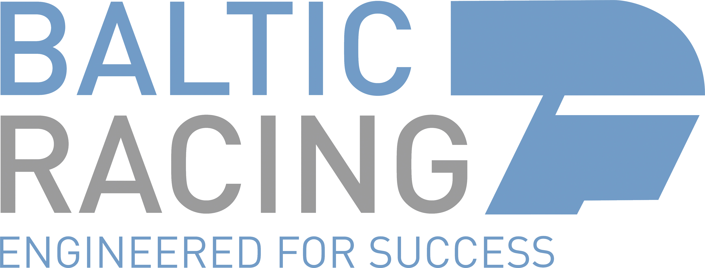
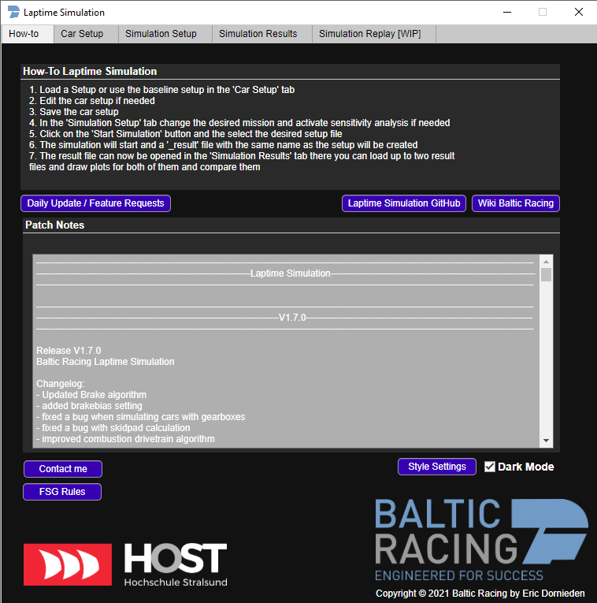
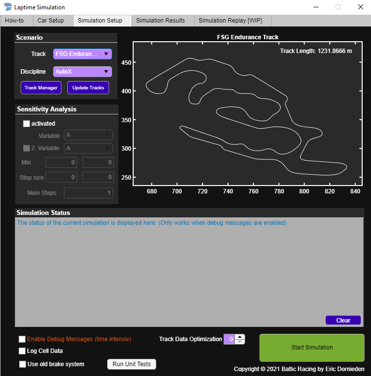
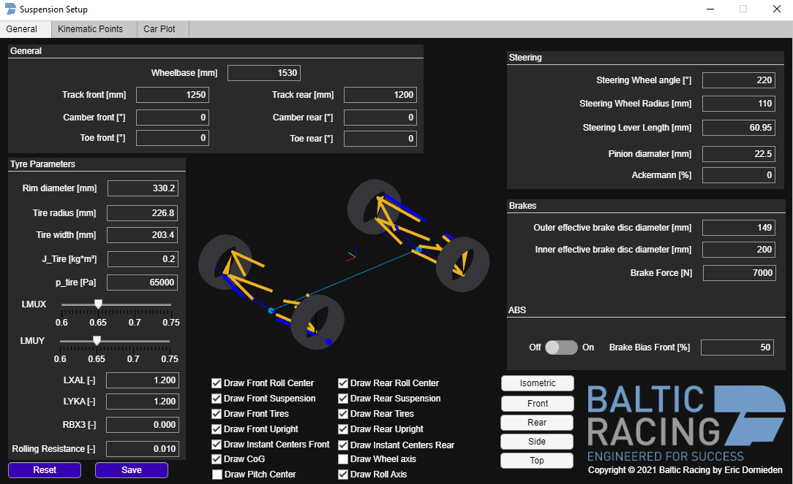
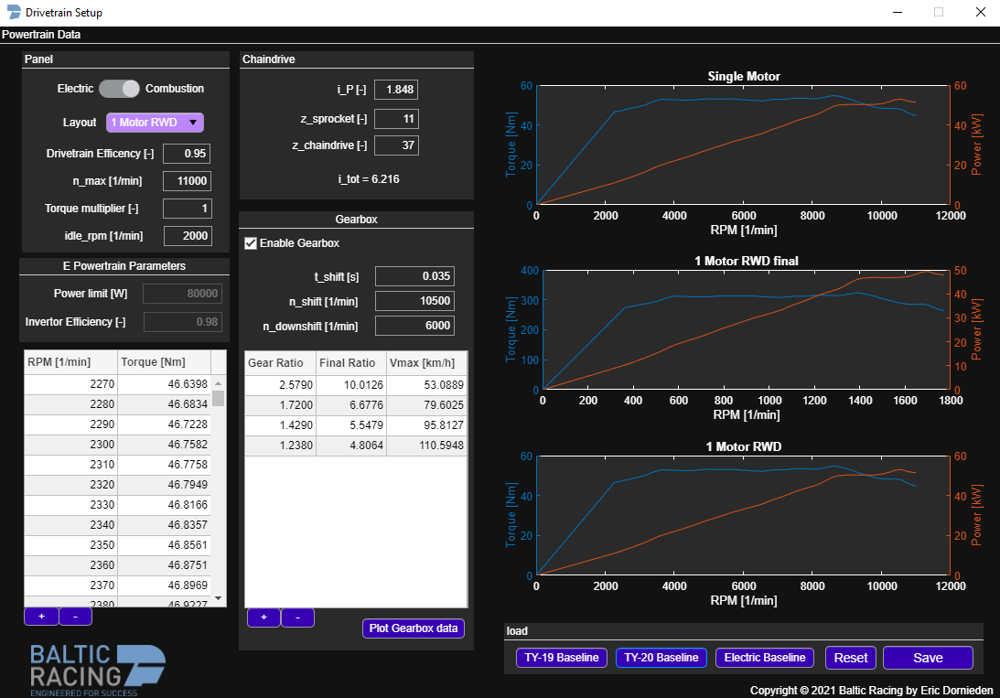
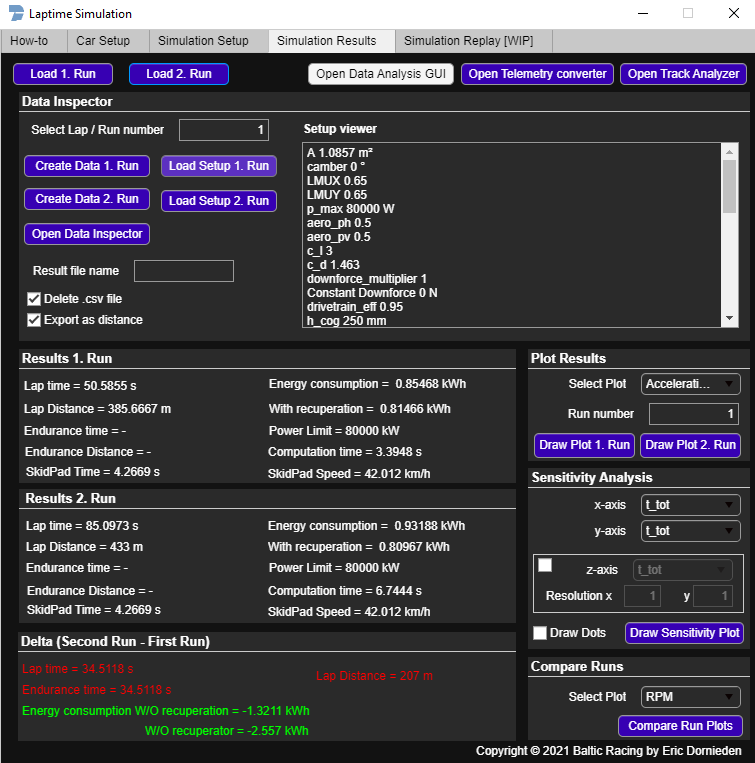
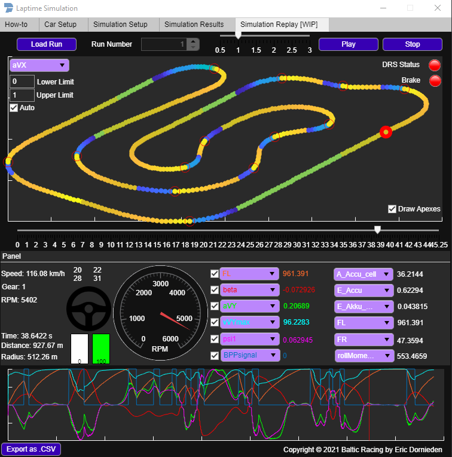

<!-- PROJECT LOGO -->
 

  

<h3 align="center">Lap Time Simulation</h3>
  
  
<!-- TABLE OF CONTENTS -->

  
Table of Contents

  <ol>
    <li>
      <a href="#feature-overview">Feature Overview</a>
      <ul>
        <li><a href="#main-gui">Main GUI</a></li>
        <li><a href="#setup-gui">Setup GUI</a></li>
        <li><a href="#suspension-gui">Suspension GUI</a></li>
        <li><a href="#drivetrain-gui">Drivetrain GUI</a></li>
        <li><a href="#result-gui">Result GUI</a></li>
        <li><a href="#replay-gui">Replay GUI</a></li>
      </ul>
    </li>
    <li><a href="#contact">Contact</a></li>
  </ol>

This project features a Laptime simulation which is capable of simulating the Acceleration, AutoX and Endurance events of the Formula Student on different tracks.
The simulation features different predefined setups and the option to simulate combustion as well as electric racecars.

A single run and a complete endurance event can be simulated, as well as a one or two-dimensional parameter sweep for sensitivity analysis.
The software also features a complete GUI in which all parameters of the simulation can be changed and where all data can be inspected.
Parameters as the suspension geometry are represented as an 3D plot and important suspension aspects like the roll centers are directly calculated from the kinematic points of the race car.

The simulation is also completely customizable using the built-in Customization App, which is featuring a pre-defined color scheme for dark and bright mode.
Each color for the dark and bright mode is also easily adjustable to the preference of the user.

The result of the simulation can be viewed using the built-in predefined plots, with the track analyzer, the real time lap replay, as well as with the Simulink Data Inspector. Using all of these different tools, different runs can be compared, and single laps can be analyzed in detail to learn the most from the setup changes that were made.

Copyright © 2021 Baltic Racing developed by: 

Lead Developer:
* [**Eric Dornieden**](https://github.com/edornieden)

Team member:
* Lukas Deeken
* Danesh Umarani

## Feature Overview

The simulation features many GUIs for different tasks a small selection of the different GUI windows which are currently implemented can be found below.

### Main GUI
  

* Main Gui with all important links and a documentation how-to use the lap time simulation. 

### Setup GUI

* GUI used to start the simulations with options to select the track, the car setup and define simulation parameters.

### Suspension GUI

* The Suspension GUI allows editing the suspension setup of the race car, including the input of all kinematic points. With that data, important parameters for the handling of the car like roll or pitch centers are calculated atomically, and the complete suspension is drawn as a dynamic 3D plot.

### Drivetrain GUI

* The different setup GUIs which can be opened from the Car Setup tab GUI allow the change of the parameters used by the simulation.

### Result GUI

* Result GUI to view the results from a simulation. Allows to plot different graphs for a single run or to directly compare multiple runs. It also features buttons to open the other GUIs which can be furthermore used to analyze the data from the simulation.

### Replay GUI

* Replay GUI to replay simulated data. The GUI features many options to display data as for example a track map with a real time representation of the race car and has options to plot and view the values at every simulation step. Critical data such as brake status is visible at every moment using intuitive GUI elements.

  <!-- CONTACT -->
## Contact

[![LinkedIn][linkedin-shield]][linkedin-url]

Eric Dornieden - e.dornieden@web.de

Project Link: [https://github.com/baltic-racing/Lap_Time_Simulation](https://github.com/baltic-racing/Lap_Time_Simulation)

(<a href="#top">back to top</a>)

[linkedin-shield]: https://img.shields.io/badge/-LinkedIn-black.svg?style=for-the-badge&logo=linkedin&colorB=555
[linkedin-url]: https://www.linkedin.com/in/eric-dornieden-83181319b/
